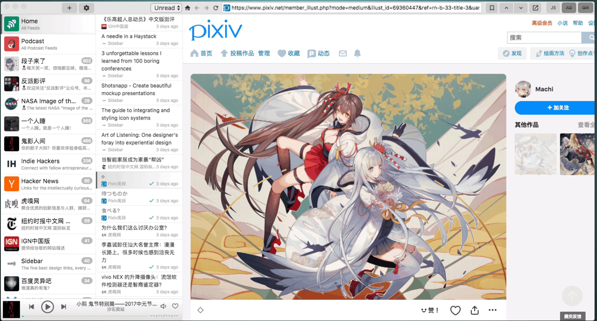

# rss-reader
一个 RSS 阅读器，可以添加 RSS 源地址，可以阅读 RSS 订阅文章。
## 技术栈
react
## 界面
软件预览图

最左侧为订阅的各个 RSS 源的名称和logo；中间为选中某一个源后，读取出来的此源的文章列表；右侧为选中某一篇文章后展示的文章内容。

右上角的 + 按钮，点击后弹出添加源的对话框；在某一个源的列表项上右键弹出菜单中可以选择编辑此源或者删除此源。